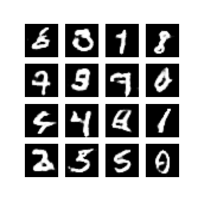

# Generative Adversarial Networks -  Image Generation

In this project, we perform a Generative Adversarial Network, where we feed the Discriminator with real images based on MNIST dataset and after several epochs run, Generator generates similar images as the handwritten digits ones. 

## Dependencies
* Install anaconda3

* Activate virtual enviroment
```angular2
sudo pip install --upgrade virtualenv
mkdir venvs
virtualenv my_venv
source my_venv/bin/activate
```

* Install python libraries
```angular2
pip install -r requirements.txt
```

## Processes

### GAN example (`src/gan_images_example.py`)
Following results of images in several epochs.
##### Real Handwritten images

##### Fake-Generated images at epoch 1

##### Fake-Generated images at epoch 5

##### Fake-Generated images at epoch 10

##### Fake-Generated images at epoch 20

##### Fake-Generated images at epoch 50

##### Fake-Generated images at epoch 99
